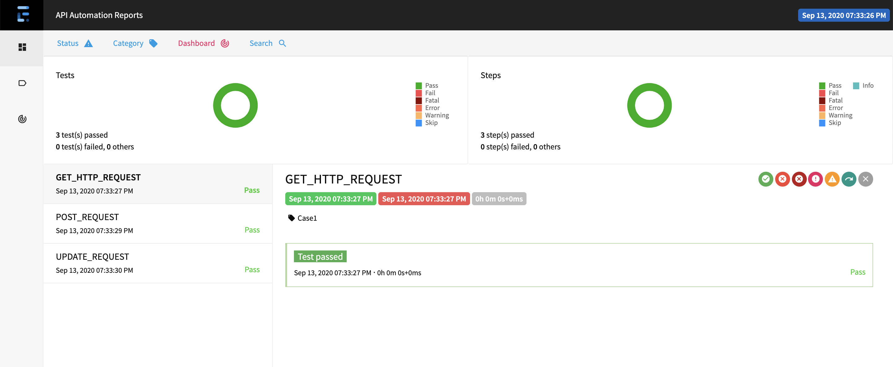

# Rest-Assured-Api-Automation-Framework
Rest API automation using Rest Assured ,Java, TestNg &amp; Maven 


## Steps to Setup

**1. Clone the application**
```bash
git clone git@github.com:Ashishjublsdet/Rest-Assured-Api-Automation-Framework.git 
```
**2.Go to project Directory**
```bash
cd Rest-Assured-Api-Automation-Framework
```
**3.Run **
```bash
run testcases.xml 
```
** POST UPDATE GET HTTP Request**


**Integrated Extent Reporting**

